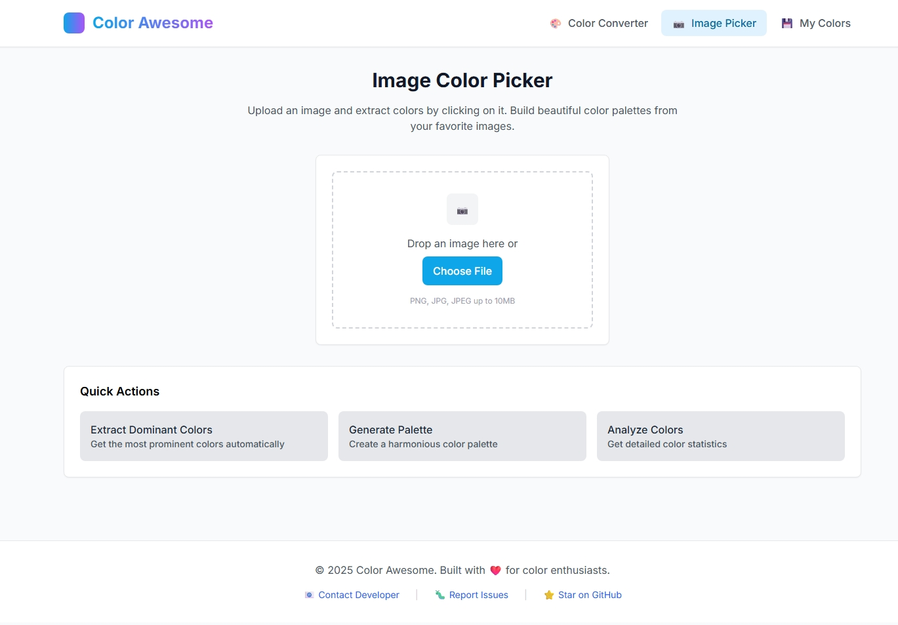
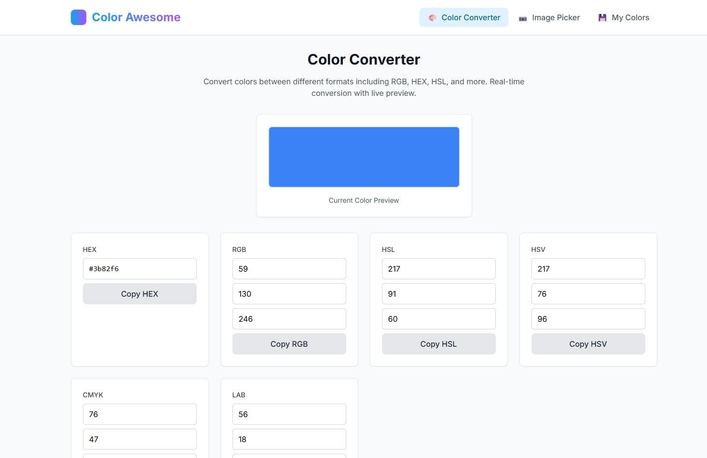

# Color Awesome

A powerful web application for color conversion, extraction, and management. Whether you're a designer, developer, or just someone who loves working with colors, Color Awesome provides all the tools you need to work with colors effectively.

**[🚀 Live Demo](https://color-awesome.pages.dev/)**

## Screenshots

### Color Converter

*Convert colors between multiple formats with real-time preview and easy copy functionality.*

### Image Color Picker

*Extract and analyze colors from uploaded images with an intuitive interface.*

## Features

### 🎨 Color Code Conversion
- Convert between multiple color formats: RGB, HEX, HSL, and more.
- Real-time conversion with a live preview.
- Copy color codes with a single click.

### 📷 Image Color Picker
- Upload and analyze image files to extract dominant colors.
- Pick specific colors by clicking on the image.
- Supports various image formats (PNG, JPG, JPEG, etc.).

### 💾 Color Collection & Management
- Save your favorite colors for future use.
- Organize colors in custom palettes.
- View all collected colors in an easy-to-browse interface.

### 🔧 Local Data Storage
- All color data is stored locally in your browser, ensuring privacy and offline access.
- No internet connection is needed once the application is loaded.
- Your color collections remain private and secure.

## Getting Started

1.  **Open the application:** Access the [🚀 Live Demo](https://color-awesome.pages.dev/) in your browser.
2.  **Convert colors:** Use the conversion tools to switch between formats.
3.  **Extract from images:** Upload an image to extract its color palette.
4.  **Build your collection:** Save the colors you like.
5.  **Access your colors:** View your saved colors at any time in the collection view.

## Use Cases

-   **Web Developers**: Quickly convert colors between CSS formats.
-   **Graphic Designers**: Effortlessly extract color palettes from images.
-   **Digital Artists**: Build and manage consistent color schemes for your artwork.
-   **UI/UX Designers**: Create and maintain consistent color systems for your projects.

## Technology

This is a client-side web application that runs entirely in your browser.

-   **Framework**: (e.g., React, Vue, Svelte, or vanilla JS)
-   **Styling**: (e.g., CSS, Sass, Tailwind CSS)
-   **State Management**: (e.g., Redux, Vuex, or local state)
-   **Local Storage**: Browser's `localStorage` API for data persistence.

## License

This project is licensed under the MIT License - see the [LICENSE.md](LICENSE.md) file for details.