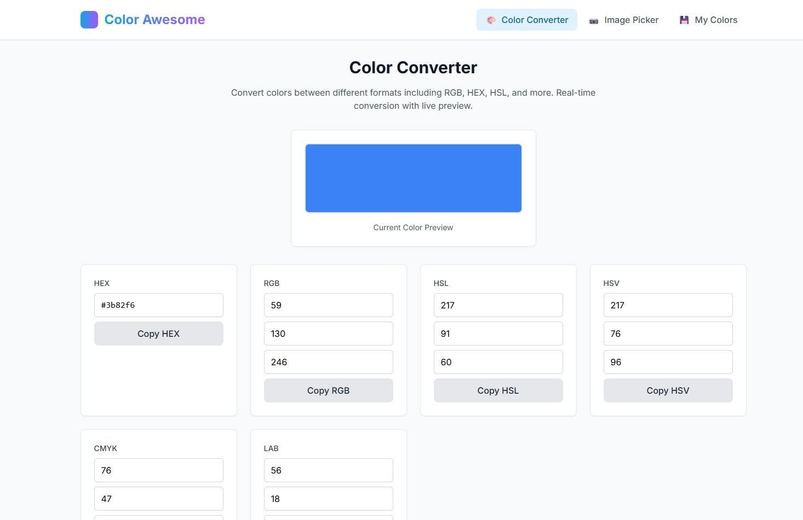
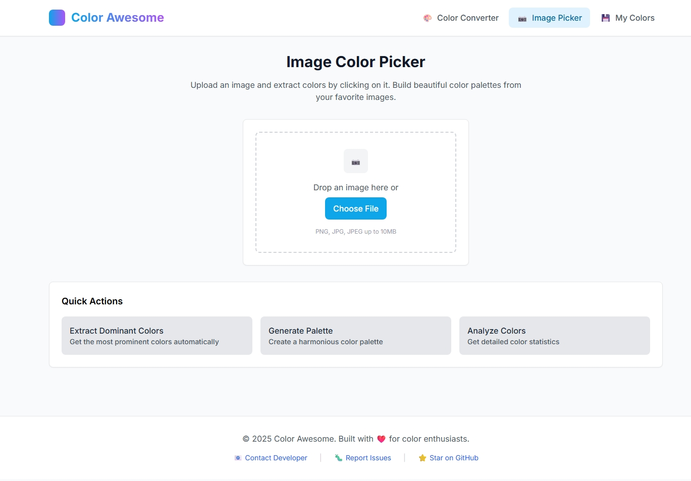

# Color Awesome

[](https://opensource.org/licenses/MIT)

A fast, client-side web app for color conversion, image-based color extraction, and palette management. Built for designers and developers who work with colors every day.

**Live Demo:** [https://color-awesome.pages.dev/](https://color-awesome.pages.dev/)

## Screenshots

### Color Converter

Convert colors between formats with real-time preview and one-click copy.

### Image Color Picker

Extract dominant colors and pick precise pixels from uploaded images.

## Features

- **Color conversion**: HEX, RGB, HSL, HSV, CMYK, LAB with live preview
- **Image color picker**: Drag-and-drop, click-to-pick, dominant colors, palettes
- **Collection management**: Save, tag, favorite, search, filter, sort, drag-and-drop
- **Keyboard-first UX**: Command palette and shortcuts for speed
- **Accessibility**: Contrast checks and WCAG-friendly UI
- **Privacy-friendly**: Data stored locally in your browser

## Tech Stack

- **Build**: Vite
- **Language**: Vanilla JavaScript (ES Modules)
- **Styling**: Tailwind CSS
- **Color utils**: chroma-js
- **Testing**: Vitest (unit/integration), Playwright (E2E)
- **Formatting/Linting**: Prettier, ESLint

## Quick Start

Prerequisites: Node.js 18+ and npm

```bash
npm install
npm run dev
```

Open `http://localhost:3000`.

### Production build

```bash
npm run build
npm run preview
```

### Tests

- Unit/Integration: `npm run test` or `npm run test:run`
- Coverage: `npm run test:coverage`
- E2E (Playwright): `npm run test:e2e` (ensure the dev server is running)

## Keyboard Shortcuts

See the full list in `USER_GUIDE.md` (Ctrl+/ in app shows a shortcuts help modal).

- **1 / 2 / 3**: Switch views (Converter / Image Picker / Collection)
- **Ctrl+K**: Command palette
- **Ctrl+C / Ctrl+S**: Copy / Save current color

## Documentation

- User Guide: `USER_GUIDE.md`
- API Docs: `API_DOCUMENTATION.md`
- Development Plan & Status: `DEVELOPMENT_PLAN.md`
- Deployment Guide: `DEPLOYMENT.md`

## Privacy

All collections are stored in your browser (`localStorage`). See the privacy policy at `public/privacy-policy.html`.

## Browser Support

Modern browsers on desktop and mobile (Chrome, Edge, Firefox, Safari).

## License

MIT. See the MIT text at `https://opensource.org/licenses/MIT`.